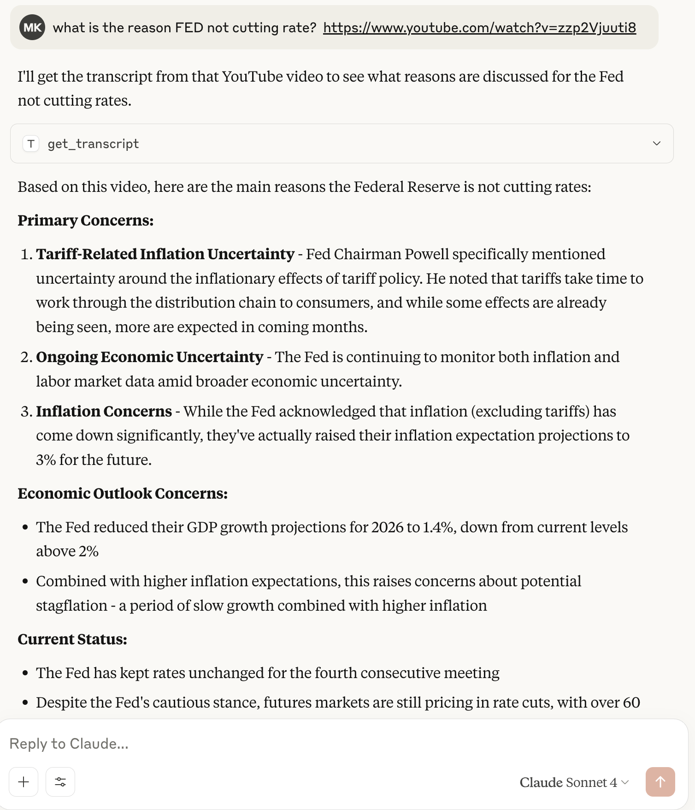

# mcp-tube-transcriber
An MCP (Model Context Protocol) server that fetches and processes YouTube transcripts from video URLs. Designed for LLM integration, it enables dynamic injection of video transcripts into model context, making it easy for agents or chains to reference YouTube content in real-time.

# Usages

# How to use?
- Clone this repo.
- cd to `mcp-tube-transcriber` and run `uv sync` (might need to install uv if you dont have already).
- Update the absolute path in `template_claude_desktop_config.json` and use it in the next step.
- Depending on the OS, follow the Claude desktop configuration in https://modelcontextprotocol.io/quickstart/server#testing-your-server-with-claude-for-desktop